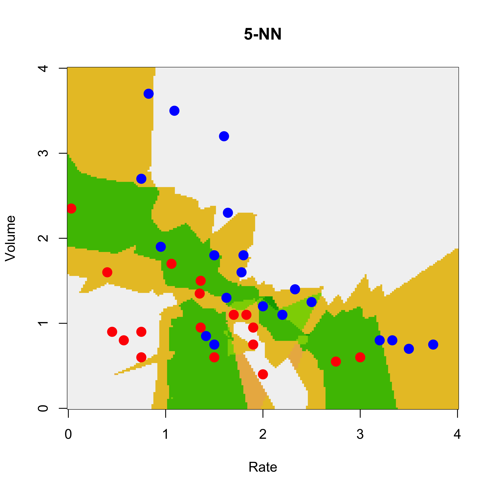

# QDA

Similarly to the way we derived the LDA classifier in class, if one relaxes the assumption
that the conditional distribution of the vector of features **X** in each class has
the same covariance matrix (*shape*) (but still assumes that these distributions are
Gaussian), then it is (again) easy to find a closed form for the conditional probability
of each class (conditional on a vector of features **X**). As in the LDA case,
these conditional class probabilities (aka *posterior probabilities*) depend on the
parameters of the assumed model for the conditional distributions of **X** in each 
class. So, again, we estimate those parameters from the training set (usin the observations
in each group) and plug them in to compute the conditional class probabilities. 

Similarly to what we did for LDA, it is easy to see that in this case the class
boundaries are quadratic functions of the vector of features **X**. 

We illustrate QDA on the same `vaso` data we used before. We first load the 
data, and train a QDA classifier using the function `qda` in package `MASS`
(this can also be written as `MASS::qda()`). 

```r
data(vaso, package = "robustbase")
library(MASS)
a.qda <- qda(Y ~ ., data = vaso)
```
We now build a relatively fine grid of points in the domain of our
2-dimensional vector of features and use the `predict` method
associated with a `qda` object to predict the conditional probability of
class `blue`:


```r
xvol <- seq(0, 4, length = 200)
xrat <- seq(0, 4, length = 200)
xx <- expand.grid(xvol, xrat)
names(xx) <- c("Volume", "Rate")
pr.qda <- predict(a.qda, newdata = xx)$posterior[, 2]
image(xrat, xvol, matrix(pr.qda, 200, 200),
  col = terrain.colors(100),
  ylab = "Volume", xlab = "Rate", cex.lab = 1.5, cex.axis = 1.5
)
points(Volume ~ Rate,
  data = vaso, pch = 19, cex = 1.5,
  col = c("red", "blue")[Y + 1]
)
contour(xrat, xvol, matrix(pr.qda, 200, 200),
  col = "gray30", levels = .5,
  drawlabels = FALSE, lwd = 3, add = TRUE
)
```


We used the function `contour` above to draw the boundary between
classes (the set of points where the probability of blue is equal to
the probability of red). 

## Sensitivity to the Gaussian assumption

We discussed in class (with the help of a simple example) the sensitivity of
QDA to the assumed specific conditional distribution of the 
features within each class. It is very easy to see that LDA may also
be affected by similar problems. This is not at all surprising--in many
cases optimal methods obtained under certain conditions are very
sensitive to the vailidity of the assumptions used in their derivation.

It is interesting to note (as discussed in class) that logistic
regression was not affected by the "good outliers" we included in 
the data. Considering where these "good outliers" are (in terms
of their corresponding likelihood values), this is probably 
not surprising. Note, furthermore, that both QDA (and LDA) and logistic regression
are classifiers that require the estimation of parameters (maybe we
can call them *parametric classifiers*?), and in all cases considered so far
the parameters were estimated using maximum likelihood. However their
sensitivity to this kind of outliers is very different. 

## More than 2 classes -- The handwritten digit recognition data

As you may have noted, all the classification methods we have seen so far can 
be used in applications with an arbitrary number of classes. We will now
illustrate them on the well-known Handwritten Digit Recognition Data
(as usual, see `help(zip.train, package='ElemStatLearn')`). We first
load the data, and extract the images corresponding to digits 0, 1 and
8. These should be challenging enough to discriminate given their
similar shapes. 

```r
data(zip.train, package = "ElemStatLearn")
data(zip.test, package = "ElemStatLearn")
x.tr <- zip.train[zip.train[, 1] %in% c(0, 1, 8), ]
x.te <- zip.test[zip.test[, 1] %in% c(0, 1, 8), ]
```
The values of the pixes of each image are in the rows of the
corresponding matrix (columns 2:256), and the true class of each image is in 
the first column. Note that there are relatively few 8's in this training set:

```r
table(x.tr[, 1])
#> 
#>    0    1    8 
#> 1194 1005  542
```
To display these 16x16 images we adapt a simple function to plot matrices:

```r
# ----- Define a function for plotting a matrix ----- #
# modified from: http://www.phaget4.org/R/image_matrix.html
myImagePlot <- function(x) {
  min <- min(x)
  max <- max(x)
  ColorRamp <- grey(seq(1, 0, length = 256))
  ColorLevels <- seq(min, max, length = length(ColorRamp))
  # Reverse Y axis
  reverse <- nrow(x):1
  x <- x[reverse, ]
  image(1:ncol(x), 1:nrow(x), t(x),
    col = ColorRamp, xlab = "",
    ylab = "", axes = FALSE, zlim = c(min, max)
  )
}
```

Next we choose 9 images at random from the training set, 
and display them in a 3x3 array of images:


```r
a <- x.tr
set.seed(987)
sa <- sample(dim(a)[1], 9)
par(mfrow = c(3, 3))
for (j in 1:9) {
  myImagePlot(t(matrix(unlist(a[sa[j], -1]), 16, 16)))
}
```


```r
par(mfrow = c(1, 1))
```

We can also show the "average 8" in the training set:


```r
myImagePlot(t(matrix(colMeans(subset(x.tr, subset = (x.tr[, 1] == 8), select = -1)), 16, 16)))
```


```r
# alternatively: myImagePlot(t(matrix(colMeans(a[a[,1]==8,-1]), 16, 16)))
```

We will now use LDA, QDA and a multinomial logistic model. The 
latter is the natural extension of logistic regression to more than
2 classes. You can easily derive it yourself by assuming that the response
variable has a multinomial distribution and modeling each 
conditional probability as a (different) logistic function of the
vector **X** of features. Note that if there are *K* classes you only need
to model *K-1* of these conditional class probabilities. The derivation
is left as an easy exercise for you. 

Note that the data is stored in a matrix, but the use of 
`lda()`, `qda()`, etc. is clearer when you have your data
in a `data frame` (as you can then refer to features by their
names and use the `data` argument). So, we first transform
our matrix into a data frame, and name the resulting variables
*V1*, *V2*, ..., *V257*:

```r
x.tr <- data.frame(x.tr)
x.te <- data.frame(x.te)
names(x.te) <- names(x.tr) <- paste("V", 1:257, sep = "")
```
Now we use `lda` and `multinom` (this last one from package `nnet`) to train 
an LDA and a multinomial classifier to these 3-class data:

```r
a <- lda(V1 ~ . - V257, data = x.tr) # x.tr[,1] ~ x[, 2:256])
library(nnet)
a.log <- multinom(V1 ~ . - V257, data = x.tr, maxit = 5000)
#> # weights:  771 (512 variable)
#> initial  value 3011.296283 
#> iter  10 value 27.327939
#> iter  20 value 8.491334
#> iter  30 value 2.640128
#> iter  40 value 1.228798
#> iter  50 value 0.663474
#> iter  60 value 0.391984
#> iter  70 value 0.212952
#> iter  80 value 0.114876
#> iter  90 value 0.053465
#> iter 100 value 0.026628
#> iter 110 value 0.014534
#> iter 120 value 0.009281
#> iter 130 value 0.006623
#> iter 140 value 0.004210
#> iter 150 value 0.002723
#> iter 160 value 0.001851
#> iter 170 value 0.001318
#> iter 180 value 0.001036
#> iter 190 value 0.000580
#> iter 200 value 0.000516
#> iter 210 value 0.000304
#> iter 220 value 0.000249
#> iter 230 value 0.000218
#> final  value 0.000090 
#> converged
```
(Question: *Why do I remove variable `V257` from the models above?*)

As a side commment: note how slow is the convergence of `multinom`. This is not unusual,
and it has to do with how neural networks are trained. Refer to 
the corresponding help page for more information. We will probably
discuss this further later in the course. 

For now we obtain the predictions on the test set and build a 
matrix of classification errors for each classifier. For LDA we have:

```r
pr.lda <- predict(a, newdata = x.te)$class
table(pr.lda, x.te$V1)
#>       
#> pr.lda   0   1   8
#>      0 353   2   9
#>      1   0 258   0
#>      8   6   4 157
```
For the logistic multinomial classifier we have: 

```r
pr.log <- predict(a.log, newdata = x.te)
table(pr.log, x.te$V1)
#>       
#> pr.log   0   1   8
#>      0 342   3  13
#>      1  12 258  10
#>      8   5   3 143
```

We now attempt to train a QDA classifier:

```r
a.qda <- try(qda(V1 ~ . - V257, data = x.tr))
#> Error in qda.default(x, grouping, ...) : rank deficiency in group 0
class(a.qda)
#> [1] "try-error"
```
This classifier cannot be trained on these data. The problem is that
the training set for at least one class is rank deficient (which can
be found by looking at the error message stored in the returned
object `a.qda`

```r
a.qda
#> [1] "Error in qda.default(x, grouping, ...) : rank deficiency in group 0\n"
#> attr(,"class")
#> [1] "try-error"
#> attr(,"condition")
#> <simpleError in qda.default(x, grouping, ...): rank deficiency in group 0>
```
Indeed, we have:

```r
x1 <- x.tr[x.tr$V1 == 0, ]
dim(x1)
#> [1] 1194  257
qr(x1)$rank
#> [1] 254
```
The questions for you are:

* why is this rank deficiency a problem for QDA, but not for LDA, or a multinomial model?
* can we do anything to train a (possibly different) QDA classifier to these data?


<!-- #### (Optional section) Sensitivity & Specificity -->

<!-- **This section is still under revision, read at your own risk.** -->

<!-- Any binary decision-making process has two important features, generally called -->
<!-- senstivity and specificity. Intuitively these measure: -->

<!-- * how often it makes correct decisions (how many *cats* are correctly classified as *cats*?) (sensitivity); and -->
<!-- * how often it makes correct positive calls (how many objects classified as *cats* are indeed *cats*?) (equivalentely, how many *not cats* are **not called cats**?) (specificity).  -->

<!-- We refer back to the `vaso` data. We train both an LDA and a QDA classifier. We can  -->
<!-- derive the associated sensitivity and specificity from the misclassification table. Note -->
<!-- that since there is no independent test set these figures may be misleading.  -->

<!-- ```{r sens1, fig.width=6, fig.height=6, message=FALSE, warning=FALSE} -->
<!-- a <- lda(Y ~ . , data=vaso) -->
<!-- a.qda <- qda(Y ~ . , data=vaso) -->
<!-- pr.lda <- as.numeric(predict(a)$class) -->
<!-- pr.qda <- as.numeric(predict(a.qda)$class) -->
<!-- table(pr.lda, vaso$Y) -->
<!-- table(pr.qda, vaso$Y) -->
<!-- ``` -->

<!-- Hence we can estimate the sensitivities of LDA and QDA as 17/19 and 16/19  -->
<!-- respectively. Their specificities are both 16/20.  -->

<!-- # sensitivity  -->
<!-- # LDA: 16/20 = 4/5 -->
<!-- # QDA: 16/20  -->

<!-- # specificity -->
<!-- # LDA: 17/19 -->
<!-- # QDA: 16/19 -->


<!-- For the zip code data: -->

<!-- ```{r zip3, fig.width=6, fig.height=6, message=FALSE, warning=FALSE} -->
<!-- data(zip.train, package='ElemStatLearn')  -->
<!-- data(zip.test, package='ElemStatLearn') -->
<!-- x.tr <- data.frame( zip.train[ zip.train[, 1] %in% c(3, 8), ] ) -->
<!-- x.te <- data.frame( zip.test[ zip.test[, 1] %in% c(3, 8), ] ) -->
<!-- names( x.te ) <- names( x.tr  ) <- paste('V', 1:257, sep='') -->
<!-- a <- lda(V1 ~ . - V257, data=x.tr) -->
<!-- te.lda <- as.numeric(predict(a, newdata=x.te)$class) -->
<!-- table(te.lda, x.te$V1) -->
<!-- ``` -->
<!-- # sensitivity - test -->
<!-- # 350/ 359 = 97.4% -->

<!-- # specificity - test -->
<!-- # 160 / 166 = 96.4% -->

<!-- # build the ROC curve -->

<!-- te.lda <- predict(a, newdata=x.te)$posterior[,1] -->
<!-- sens <- spec <- rep(0, 50) -->
<!-- als <- seq(0, 1, length=51) -->
<!-- for(i in 1:50) { -->
<!--   npr.1 <- (te.lda > als[i]) -->
<!--   npr.2 <- !npr.1 -->
<!--   sens[i] <- sum( (as.numeric(as.factor(x.te$V1)) == 1) & npr.1 ) -->
<!--   spec[i] <- sum( (as.numeric(as.factor(x.te$V1)) == 2) & npr.2 ) -->
<!-- } -->
<!-- sens <- sens / sum(as.numeric(as.factor(x.te$V1)) == 1) -->
<!-- spec <- spec / sum(as.numeric(as.factor(x.te$V1)) == 2) -->
<!-- plot(1-spec, sens, type='b', ylim=c(0,1), xlim=c(0,1)) -->


## K-Nearest Neighbours (K-NN)

Perhaps the intuitively simplest model-free estimator for conditional class probabilities 
for a given set of feature values **X** is the one based on nearest neighbours
(as discussed in class). It is similar (in *spirit*) to the kernel regression
estimator in the continuous-response regression setting. More specifically,
it can be thought of as a variable-bandwidth kernel estimator. For a 
point **X** in the feature space we look at the proportion of observations
in each class among **X**'s K-th closest neighbours. That is, of course, equivalent
to looking at all points $(Y_i, \mathbf{X}_i)$ in the training set such that 
$\left\| \mathbf{X}_i - \mathbf{X} \right\| \le h_k$, where $h_k$ is the 
distance from **X** to the K-th closest neighbour in the training set.
Refer to the discussion in class for more details. 

Here we will illustrate K-NN classifiers on the toy `vaso` example (to be able to
visualize the results more easily), and also on the hand written digits data. 
We will use the function `knn` in package `class`. This function takes a 
training set, and also a *test* set (i.e. a different data set containing the
observations to be predicted). In the example below we first create (as 
we have done before) a 200 x 200 grid of points and display the resulting
predicted probabilities (or the corresponding class with highest conditional
probability). 

We first we use a trivial 1-NN classifier: the estimated conditional probabilities
for each class at a point **X**, will simply be 0 or 1 depending on the class of the closest
neighbour to **X** in the training set. 

```r
library(class)
data(vaso, package = "robustbase")
x1 <- seq(0, 4, length = 200)
x2 <- seq(0, 4, length = 200)
xx <- expand.grid(x1, x2)
u1 <- knn(train = vaso[, c(2, 1)], cl = vaso[, 3], test = xx, k = 1)
u1 <- as.numeric(u1)
image(x1, x2, matrix(u1, 200, 200),
  col = terrain.colors(100),
  ylab = "Volume", xlab = "Rate", main = "1-NN"
)
points(Volume ~ Rate,
  data = vaso, pch = 19, cex = 1.5,
  col = c("red", "blue")[Y + 1]
)
```


We repeat the analysis with a 5-NN classifier. Now the estimated 
conditional probabilities 
for each **X** in the grid can be 0, 0.20, 0.40, 0.60, 0.80 or 1 (why?)
The function `knn` returns the estimated probabilities in the 
`'prob'` attribute of the returned object, so we need to use the
function `attr` to extract it (as usual, the R help pages are 
a good source of information if you have any questions about the 
code below): 


```r
u5 <- attr(
  knn(train = vaso[, c(2, 1)], cl = vaso[, 3], test = xx, k = 5, prob = TRUE),
  "prob"
)
image(x1, x2, matrix(u5, 200, 200),
  col = terrain.colors(100),
  ylab = "Volume", xlab = "Rate", main = "5-NN"
)
points(Volume ~ Rate,
  data = vaso, pch = 19, cex = 1.5,
  col = c("red", "blue")[Y + 1]
)
```




We now turn to the digits data. We now look at the images 
for digits 1, 3 and 8 and create the corresponding 
training and test sets:

```r
data(zip.train, package = "ElemStatLearn")
data(zip.test, package = "ElemStatLearn")
x.tr <- data.frame(zip.train[zip.train[, 1] %in% c(1, 3, 8), ])
x.te <- data.frame(zip.test[zip.test[, 1] %in% c(1, 3, 8), ])
names(x.te) <- names(x.tr) <- paste("V", 1:257, sep = "")
```
We now train 1-, 5-, 10- and 50-NN classifiers and evaluate them on
the test set. We report the misclassification rate on the test set, 
along with the corresponding tables:

```r
u1 <- knn(train = x.tr[, -1], cl = x.tr[, 1], test = x.te[, -1], k = 1)
table(u1, x.te$V1)
#>    
#> u1    1   3   8
#>   1 261   0   0
#>   3   3 162   9
#>   8   0   4 157
mean(u1 != x.te$V1)
#> [1] 0.02684564
u5 <- knn(train = x.tr[, -1], cl = x.tr[, 1], test = x.te[, -1], k = 5)
table(u5, x.te$V1)
#>    
#> u5    1   3   8
#>   1 261   1   0
#>   3   3 161   7
#>   8   0   4 159
mean(u5 != x.te$V1)
#> [1] 0.02516779
u10 <- knn(train = x.tr[, -1], cl = x.tr[, 1], test = x.te[, -1], k = 10)
table(u10, x.te$V1)
#>    
#> u10   1   3   8
#>   1 261   1   3
#>   3   3 163  12
#>   8   0   2 151
mean(u10 != x.te$V1)
#> [1] 0.0352349
u50 <- knn(train = x.tr[, -1], cl = x.tr[, 1], test = x.te[, -1], k = 50)
table(u50, x.te$V1)
#>    
#> u50   1   3   8
#>   1 261   2   7
#>   3   3 159  18
#>   8   0   5 141
mean(u50 != x.te$V1)
#> [1] 0.05872483
```
Note how the performance of the K-NN classifier in this case 
stops improving when K is larger than 5. Since the number *K* of 
nearest neighbours is in fact a tuning constant that needs to
be chosen by the user, how would do it in an objective way? 
What would you do if you didn't have a test set available? 


## Challenges for K-NN classifiers

* It is easy to see that they suffer from the *curse of dimensionality*.
* Factor or binary features need to be treated with care.
* Euclidean distances do not reflect *shape* of features in each class (i.e. the
conditional distribution of **X** in each class). Class-wise pre-standardization 
(whitening) might be useful. 

To illustrate the last point, consider this toy synthetic example we discussed in class:


```r
# create example
set.seed(123)
x <- matrix(runif(250 * 2, min = -1, max = 1), 250, 2)
norm2 <- function(a) sqrt(sum(a^2))
r <- apply(x, 1, norm2)
a <- (r > .4) & (r < .7)
x <- x[a, ]
# plot(x, xlim=c(-1,1), ylim=c(-1,1))
l1 <- (x[, 1] > 0)
l2 <- (x[, 2] > 0)
a <- l1 & !l2
b <- l1 & l2
d <- !l1 & l2
la <- rep("C", nrow(x))
la[a] <- "A"
la[b] <- "B"
la[d] <- "D"
# plot(x, pch=la)
x2 <- x
x2[, 1] <- x2[, 1] * 1e5


# plot(x2, pch=la, cex=1.5)
#
# # pick a point
# points(x2[26,1], x2[26, 2], pch='A', col='red', cex=1.9)

# find closest neighbour
x0 <- x2[26, ]
d <- apply(scale(x2, center = x0, scale = FALSE), 1, norm2)
h <- sort(d)[2]
e <- (1:nrow(x2))[d == h]
plot(x2, pch = la, cex = 1.5, xlab = expression(X[1]), ylab = expression(X[2]))
points(x2[26, 1], x2[26, 2], pch = "A", col = "red", cex = 1.9)
points(x2[e, 1], x2[e, 2], pch = "O", col = "red", cex = 1.9)
text(-5000, 0, labels = "Closest neighbour", cex = 1.5, col = "red")
arrows(x2[26, 1], x2[26, 2] + .1, x2[e, 1], x2[e, 2] - .1, lwd = 5, col = "red")
```


```r
# pdf('knn-challenge.pdf', bg='transparent')
# plot(x2, pch=la, cex=1.5, col='gray30', xlab='', ylab='')
# points(x2[26,1], x2[26, 2], pch='A', col='red', cex=1.9)
# points(x2[e,1], x2[e, 2], pch=19, col='red', cex=3)
# arrows(x2[26, 1], x2[26,2] + .15, x2[e,1], x2[e,2]-.15, lwd=7, col='red')
# text(-5000, 0, labels='Closest neighbour', cex=1.5, col='red')
# dev.off()
```

