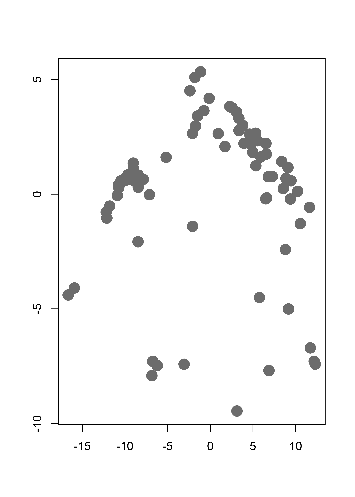
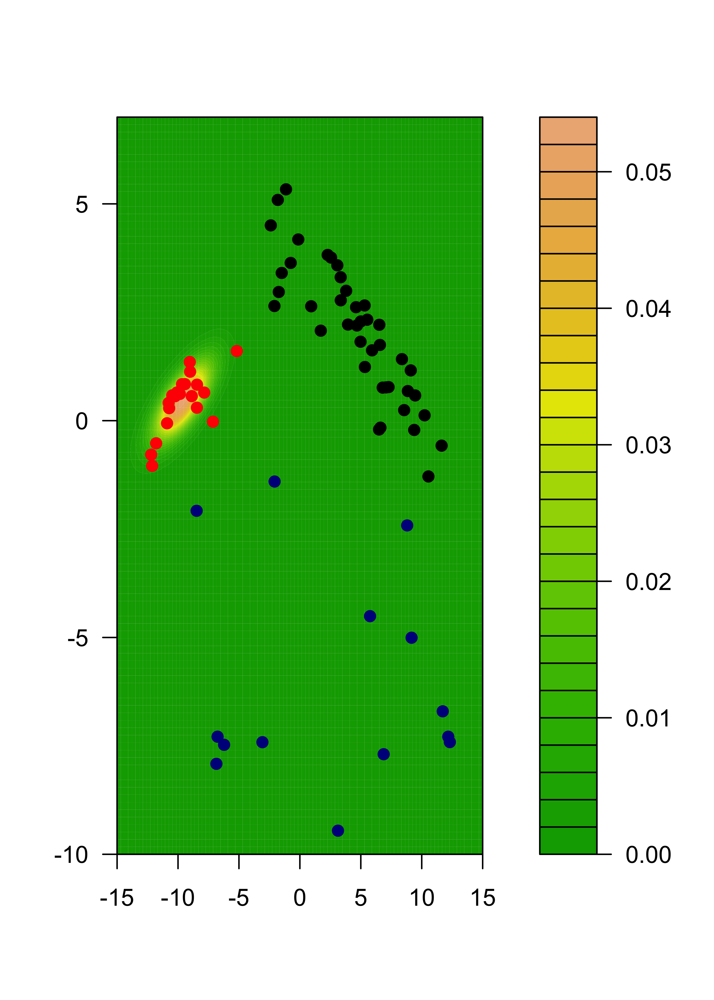
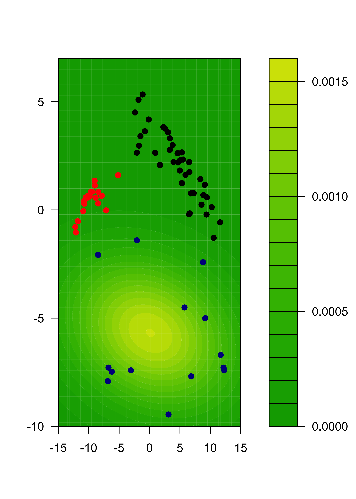
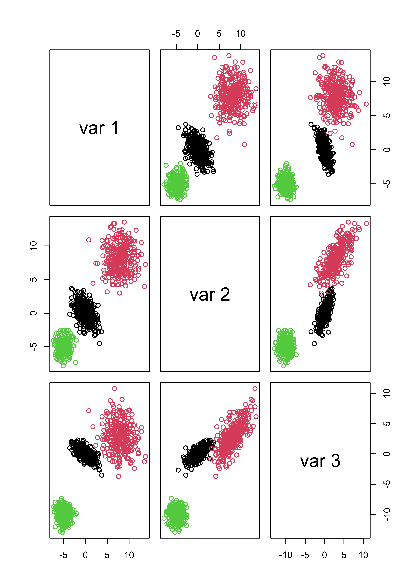
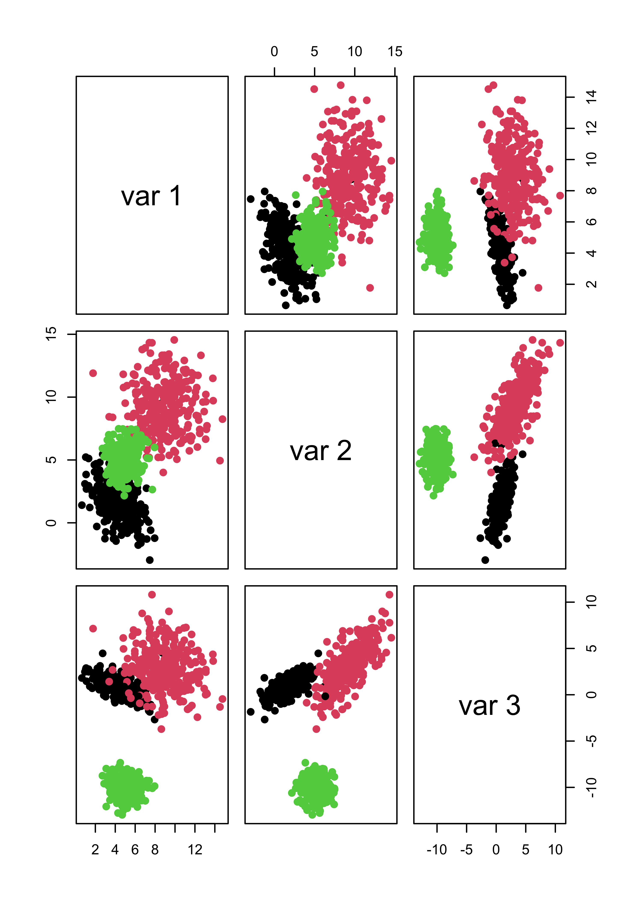
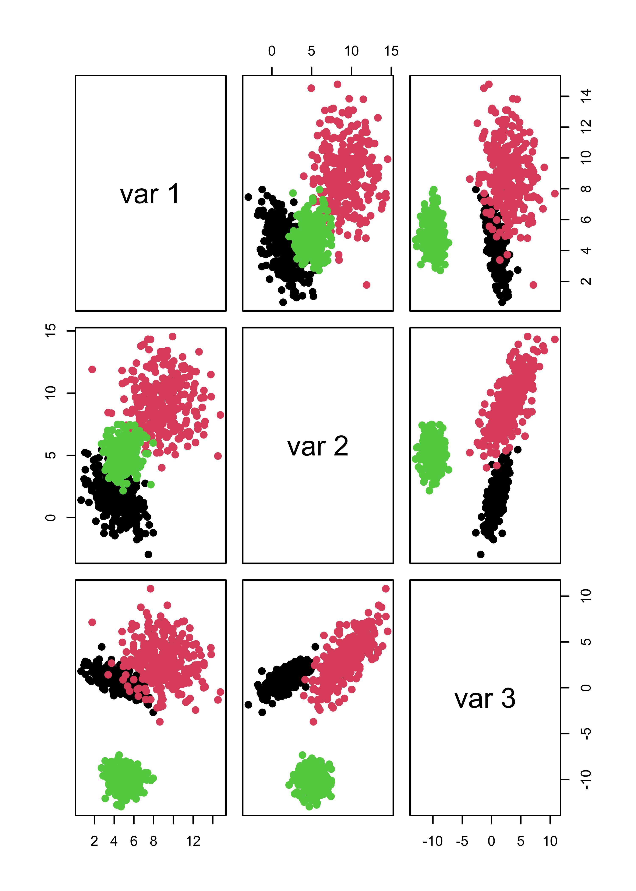
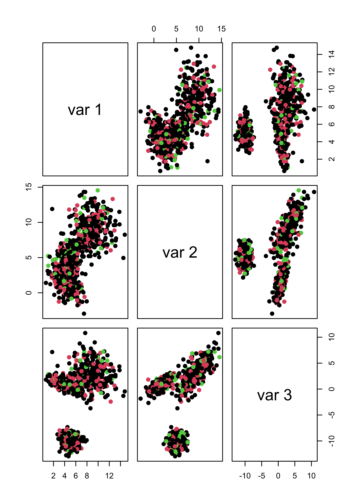
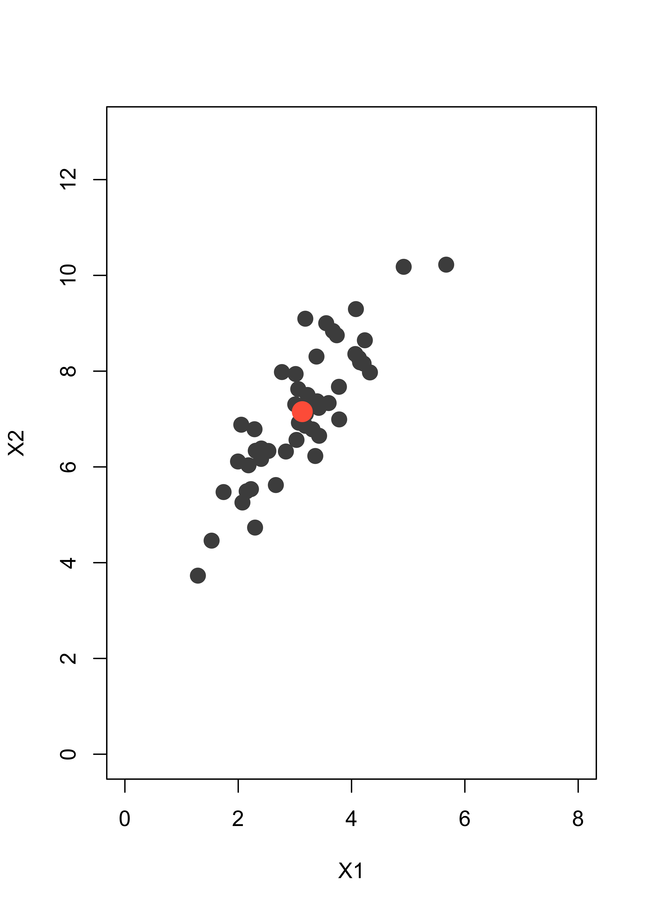
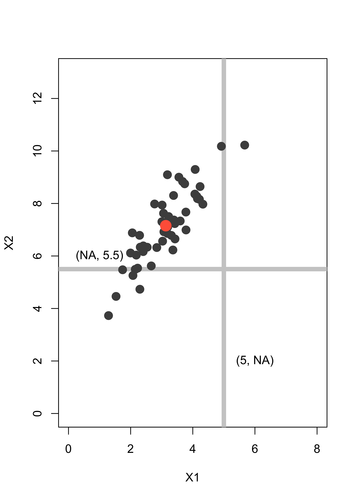

# Model based clustering

Model-based clustering methods depend on a probabilistic 
model that specifies the distribution of the observed features
(over the whole population). This distribution is 
typically modelled as a mixture of several
different distributions. Given a sample of *n* vectors of
features $X_1$, $X_2$, ..., $X_n$, the clustering problem then becomes 
the estimation of the *n* unobserved labels that indicate to which
sub-population (cluster, group) each $X_i$ belongs. In addition, 
one generally also has to estimate the parameters that specify the 
distribution of $X$ in each assumed group.

Given that this method is based on a full specificification of 
the distribution of the observed vector of features, it is not 
surprising that the parameters are generally estimated using maximum
likelihood. The difficulty is that there are *n* unobserved (missing)
variables (the group labels) that also need to be estimated (*imputed*).
The most commonly used approach uses the EM algorithm to 
perform maximum likelihood estimation with missing observations.

## EM algorithm

The specifics of the EM algorithm were introduced and discussed in
class. Although the algorithm may seem clear at first sight, 
it is fairly subtle, and mistakes and misunderstandings are 
very (**very**) common. Many applications of the EM algorithm
found on-line are either wrong, or wrongly derived. 
For a more detailed discussion and a different
(and also very useful) application of the algorithm, see the
Section  **Imputation via EM** below.


## Bivariate Gaussian mixture model via EM "by hand"

We will use a 2-dimensional representation of the
UN votes data. This lower-dimensional representation
is obtained using multidimensional scaling, a topic
we will cover later in the course. For formulas
and specific steps of the algorithm please refer 
to your class notes. 
We first load the data and reduce it to a 2-dimensional
problem, in order to be able to plot the results. 
It will be a very nice exercise for the reader to 
re-do this analysis on the original data set.

```r
X <- read.table(file = "data/unvotes.csv", sep = ",", row.names = 1, header = TRUE)
# Compute pairwise distances and use MDS
dd <- dist(t(X))
tmp <- cmdscale(dd, k = 2)
```

This is the data with which we will work: 


```r
plot(tmp, pch = 19, col = "gray50", cex = 2, xlab = "", ylab = "")
```



We will now use the EM algorithm to find (Gaussian-ly
distributed) clusters in the data. First
we find initial maximum likelihood estimators (i.e. initial
values for the EM algorithm), using a random
partition of the data:

```r
k <- 3
n <- nrow(tmp)
set.seed(123456)
b <- sample((1:n) %% k + 1)
gammas <- matrix(0, n, k)
for (j in 1:k) gammas[b == j, j] <- 1
pis <- colSums(gammas) / n
mus <- sigmas <- vector("list", k)
for (j in 1:k) {
  mus[[j]] <- colSums(tmp * gammas[, j]) / sum(gammas[, j])
  sigmas[[j]] <- t(tmp * gammas[, j]) %*% tmp / sum(gammas[, j])
}
```
Note that the above loop could have been computed more efficiently
using the fact that at the initial
step the gamma coefficients are either 0's or 1's. 
However, in the following steps of the EM algorithm we will
need to use such *weighted averages* computations, since
in general the weights are between 0 and 1. 

This is the initial configuration (pure noise):


```r
plot(tmp[, 1], tmp[, 2], pch = 19, cex = 2, 
     col = c("black", "red", "darkblue")[b], xlab = "", ylab = "")
```


We now launch our iterations. Here I run 120 iterations. Can you 
think of an appropriate convergence criterion? Should
we look at the parameter
estimates, the gammas (posterior class probabilities), 
the likelihood function?

```r
library(mvtnorm)
niter <- 120
for (i in 1:niter) {
  # E step
  # compute posterior probabilites f(x_i, \theta^k)
  for (j in 1:k) {
    gammas[, j] <- apply(tmp, 1, dmvnorm, mean = mus[[j]], 
                         sigma = sigmas[[j]])
  }
  # multiply by probs of each class
  # f(x_i, \theta^k) * pi_k
  gammas <- gammas %*% diag(pis)
  # standardize: f(x_i, \theta^k) * pi_k / [ sum_s { f(x_i, \theta^s) * pi_s } ]
  gammas <- gammas / rowSums(gammas)
  # M step
  # the maximizers of the expected likelihood have
  # a closed form in the Gaussian case, they are
  # just weighted means and covariance matrices
  for (j in 1:k) {
    mus[[j]] <- colSums(tmp * gammas[, j]) / sum(gammas[, j])
    tmp2 <- scale(tmp, scale = FALSE, center = mus[[j]])
    sigmas[[j]] <- t(tmp2 * gammas[, j]) %*% tmp2 / sum(gammas[, j])
  }
  # update pi's
  pis <- colSums(gammas) / n # n = sum(colSums(gammas))
}
```
We now plot the estimated density for X, which is
a combination of 3 gaussian densities.
We do this by evaluating the estimated densities
on a relatively fine grid of points and displaying them.
We will color the points according to the estimated
group labels (the largest estimated posterior
probability for each point). We first compute those


```r
# estimated groups
emlab <- apply(gammas, 1, which.max)
# build a 100 x 100 grid
ngr <- 100
x1 <- seq(-15, 15, length = ngr)
x2 <- seq(-10, 7, length = ngr)
xx <- expand.grid(x1, x2)
# evaluate each density component on each grid point
m <- matrix(NA, ngr * ngr, k)
for (j in 1:k) {
  m[, j] <- apply(xx, 1, dmvnorm, mean = mus[[j]], sigma = sigmas[[j]])
}
# apply weights
mm <- m %*% pis # apply(m, 1, max)
filled.contour(x1, x2, matrix(mm, ngr, ngr),
  col = terrain.colors(35),
  xlab = "", ylab = "",
  panel.last = {
    points(tmp[, 1], tmp[, 2], pch = 19, cex = 1, col = c("black", "red", "darkblue")[emlab])
  }
)
```


We can also show each separate estimated component:


```r
m2 <- m %*% diag(pis)
for (j in 1:k) {
  filled.contour(x1, x2, matrix(m2[, j], ngr, ngr),
    col = terrain.colors(35), xlab = "", ylab = "",
    panel.last = {
      points(tmp[, 1], tmp[, 2], pch = 19, cex = 1, col = c("black", "red", "darkblue")[emlab])
    }
  )
}
```



## Model assumptions may be important

We will illustrate the problem with a synthetic data set.
There are 3 groups with 300 observations in each, 
and 3 variables / features.

```r
# sample size
n <- 300

# covariance matrices for two of the groups
s1 <- matrix(c(2, -1, -1, -1, 2, 1, -1, 1, 1), ncol = 3, byrow = TRUE)
s2 <- matrix(c(4, 0, -1, 0, 4, 3, -1, 3, 5), ncol = 3, byrow = TRUE)
s1.sqrt <- chol(s1)
s2.sqrt <- chol(s2)

# easy case, well separated groups
set.seed(31)
x1 <- matrix(rnorm(n * 3), n, 3) %*% s1.sqrt
mu2 <- c(8, 8, 3)
x2 <- scale(matrix(rnorm(n * 3), n, 3) %*% s2.sqrt, center = -mu2, scale = FALSE)
mu3 <- c(-5, -5, -10)
x3 <- scale(matrix(rnorm(n * 3), n, 3), center = -mu3, scale = FALSE)
x <- rbind(x1, x2, x3)
```

This is how the data look


```r
pairs(x, col = "gray", pch = 19)
```


It is not a surprise that model-based clustering works
very well in this case:


```r
library(mclust)
# select the number of clusters using likelihood-base criterion
m <- Mclust(x)
# show the data, color-coded according to the groups found
pairs(x, col = m$class)
```



We now create a data set that does not satisfy the model:


```r
set.seed(31)
x1 <- matrix(rexp(n * 3, rate = .2), n, 3)
mu2 <- c(10, 20, 20)
x2 <- scale(matrix(runif(n * 3, min = -6, max = 6), n, 3), center = -mu2, scale = FALSE)
mu3 <- c(-5, -5, -5)
x3 <- scale(matrix(rnorm(n * 3, sd = 3), n, 3), center = -mu3, scale = FALSE)
x.3 <- rbind(x1, x2, x3)

# run model-based clustering,
# select the number of clusters using likelihood-base criterion
m3 <- Mclust(x.3)

# show the data, colors according to groups found
pairs(x.3, col = m3$class)
```


The problem is with the likelihood-based criterion used by 
`mclust()` to select the number of clusters. Note that the
function increases until k = 3, and it 
almost stops growing after k = 4. The 
the maximum is nonetheless attained at k = 8.


```r
plot(m3$BIC[, 6], type = "b", xlab = "K", ylab = "BIC", lwd = 2, pch = 19)
```


It is interesting to note that 
K-means would have found
the right number of clusters and cluster memberships
rather easily. Here is the sum-of-squares plot based
on K-means, which indicates that K = 3 is a sensible
choice:


```r
# run k-means with k = 2, 2, ..., 10
# to try to identify how many clusters are present
m3.l <- vector("list", 10)
ss <- rep(0, 10)
for (i in 2:10) {
  ss[i] <- sum((m3.l[[i]] <- kmeans(x.3, centers = i, nstart = 500))$within)
}
plot(2:10, ss[-1], xlab = "K", ylab = "W_k", type = "b", lwd = 2, pch = 19)
```


The clusters found when K-means was run with kK = 3 were:


```r
pairs(x.3, col = m3.l[[3]]$cluster)
```


Furthermore, if you force `mclust()` to use 3 classes
it works fairly well, even thought the model is wrong. The 
main problem here is that BIC depends heavily on the 
assumed likelihood / probabilistic model:


```r
m3.3 <- Mclust(x.3, G = 3)
pairs(x.3, col = m3.3$class)
```


## Behaviour when there are noise variables

The presence of noise variables (i.e. features that
are non-informative about clusters that may
be present in the data) can be quite damaging to
these methods (both K-means and mclust)
We will create two data sets with "noise" features:
one with Gaussian noise, and
one with uniformly distributed noise.

```r
set.seed(31)
x1 <- matrix(rnorm(n * 3, mean = 3), n, 3) %*% s1.sqrt
mu2 <- c(9, 9, 3)
x2 <- scale(matrix(rnorm(n * 3), n, 3) %*% s2.sqrt, center = -mu2, scale = FALSE)
mu3 <- c(5, 5, -10)
x3 <- scale(matrix(rnorm(n * 3), n, 3), center = -mu3, scale = FALSE)
x <- rbind(x1, x2, x3)
# non-normal "noise" features
x.4 <- cbind(x, matrix(rexp(n * 3 * 3, rate = 1 / 10), n * 3, 3))
# normal "noise" features
x.5 <- cbind(x, matrix(rnorm(n * 3 * 3, mean = 0, sd = 150), n * 3, 3))
```
We now find clusters using a Gaussian model,
and select the number of clusters using likelihood-base criterion:

```r
m4 <- Mclust(x.4)
m5 <- Mclust(x.5)
```
If we use the first 3
features (which are the ones that determine the
cluster structure)
to
show the clusters found by `mclust`
when the noise was not Gaussian, we get:


```r
pairs(x.4[, 1:3], col = m4$class, pch = 19)
```


And even when the noise had a Gaussian
distribution, we do not identify the ``right'' clusters:

```r
# pairs(x.5[,1:3], col=m5$class, pch=19)
table(m5$class, rep(1:3, each = n))
#>    
#>       1   2   3
#>   1 300   1   0
#>   2   0 299   0
#>   3   0   0 300
```

If we force `mclust()` to identify 3 clusters, things look
much better both for Gaussian and non-Gaussian noise:


```r
m4.3 <- Mclust(x.4, G = 3)
m5.3 <- Mclust(x.5, G = 3)
# it works well
pairs(x.4[, 1:3], col = m4.3$class, pch = 19)
```



```r
pairs(x.5[, 1:3], col = m5.3$class, pch = 19)
```




```r
table(m4.3$class, rep(1:3, each = n))
#>    
#>       1   2   3
#>   1 300   5   0
#>   2   0 295   0
#>   3   0   0 300
table(m5.3$class, rep(1:3, each = n))
#>    
#>       1   2   3
#>   1 300   1   0
#>   2   0 299   0
#>   3   0   0 300
```

Note that noise also affects K-means seriously.
I refer you to the robust and sparse K-means
method (links on the module's main page).

Within sum-of-squares plot
for K-means with non-Gaussian noise:


```r
m4.l <- vector("list", 10)
ss <- rep(0, 10)
for (i in 2:10) {
  ss[i] <- sum((m4.l[[i]] <- kmeans(x.4, centers = i, nstart = 100, iter.max = 20))$within)
}
plot(2:10, ss[-1], xlab = "K", ylab = "W_k", type = "b", lwd = 2, pch = 19)
```


Within sum-of-squares plot
for K-means with Gaussian noise:


```r
m5.l <- vector("list", 10)
ss <- rep(0, 10)
for (i in 2:10) {
  ss[i] <- sum((m5.l[[i]] <- kmeans(x.5, centers = i, nstart = 100, iter.max = 20))$within)
}
plot(2:10, ss[-1], xlab = "K", ylab = "W_k", type = "b", lwd = 2, pch = 19)
```


Not even forcing `k-means` to identify 3 clusters helps when
there are noise features:


```r
pairs(x.4[, 1:3], col = m4.l[[3]]$cluster, pch = 19)
```



```r
pairs(x.5[, 1:3], col = m5.l[[3]]$cluster, pch = 19)
```


## Imputation via EM (a detailed example "by hand")

Missing data is a rather prevalent problem,
and different strategies to replace them by sensible 
"predictions" exit. They are collectively
called "imputation methods". In these notes we will 
follow the missing data example discussed in class and
use the EM algorithm to impute partially unobserved data points in a
synthetic bivariate Gaussian data set. Furthemore, the scripts
below are designed for the case where only one
entry may be missing in each observation. It is not
difficult to extend this to data with more coordinates
and more than one entry missing. Please refer to your 
class notes for formulas and details. 

### A synthetic example

To illustrate the method in a simple setting where
we can visualize the ideas on a 2-dimensional scatter
plot, we will work with a *toy* example. 
We first create a simple synthetic data set with
50 observations in 2 dimensions, normally distributed with center
at the point (3,7), and a fairly strong correlation
between its two coordinates:

```r
library(mvtnorm)
# mean vector
mu <- c(3, 7)
# variance/covariance matrix
si <- matrix(c(1, 1.2, 1.2, 2), 2, 2)
# generate data
set.seed(123)
x <- rmvnorm(50, mean = mu, sigma = si)
```
This is the data. The larger red point indicates
the sample mean (3.13, 7.15):


```r
plot(x, pch = 19, col = "gray30", xlim = c(0, 8), ylim = c(0, 13), xlab = "X1", ylab = "X2", cex = 1.5)
xbar <- colMeans(x)
points(xbar[1], xbar[2], pch = 19, col = "tomato", cex = 2)
```



Assume we have an observation (5, **NA**) where the 
second coordinate is missing, and 
another one (**NA**, 5.5) with the first coordinate
missing. We indicate them with grey lines
to indicate the uncertainty about their missing
entries:


```r
plot(x, pch = 19, col = "gray30", xlim = c(0, 8), ylim = c(0, 13), xlab = "X1", ylab = "X2", cex = 1.5)
abline(v = 5, lwd = 6, col = "gray80")
abline(h = 5.5, lwd = 6, col = "gray80")
points(x, pch = 19, col = "gray30", cex = 1.5)
points(xbar[1], xbar[2], pch = 19, col = "tomato", cex = 2)
text(1, 6, "(NA, 5.5)")
text(6, 2, "(5, NA)")
```



A simple method to impute the missing coordinates would be to
replace them by the mean of the missing variable over the
rest of the data. Hence (5, **NA**) becomes (5, *7.15*) and 
(**NA**, 5.5) becomes (*3.13*, 5.5). The imputed points
are shown below as blue dots:


```r
plot(x, pch = 19, col = "gray30", xlim = c(0, 8), ylim = c(0, 13), xlab = "X1", ylab = "X2", cex = 1.5)
abline(h = 5.5, lwd = 6, col = "gray80")
abline(v = 5, lwd = 6, col = "gray80")
points(x, pch = 19, col = "gray30", cex = 1.5)
points(xbar[1], xbar[2], pch = 19, col = "tomato", cex = 2)
points(5, xbar[2], pch = 19, col = "steelblue", cex = 2)
points(xbar[1], 5.5, pch = 19, col = "steelblue", cex = 2)
```


Note that the imputed points are in fact away from the bulk
of the data, even though this is not
apparent if you look at each 
coordinate separately. 
A better imputation method uses the EM algorithm. 

We assume that the points in our data can be modelled as
occurences of a bivariate random vector with a normal / Gaussian
distribution. The unknown parameters are its mean vector
and 2x2 variance/covariance matrix. The EM algorithm will alternate
between computing the expected value of the log-likelihood for the 
full (non-missing) data set conditional on the actually observed
points (even incompletely observed ones), and finding the
parameters (mean vector and covariance matrix) that maximize
this conditional expected log-likelihood. 

It is not trivial to see that the conditional expected log-likelihood
equals a constant (that depends only on the parameters from the 
previous iteration) plus the log-likelihood of a data set where the
missing coordinates of each observation are
replaced by their conditional expectation
(given the observed entries in the same unit). Refer to the 
discussion in class for more details. 

We now implement this imputation method in `R`. First add 
the two incomplete observations to
the data set above, we append them at the "bottom" of the 
matrix `x`:

```r
set.seed(123)
dat <- rbind(x, c(5, NA), c(NA, 5.5))
```
Next, we compute initial values for the estimates of the parameters 
of the model. These can be, for example, the sample mean and 
sample covariance matrix using only the fully observed
data points:

```r
mu <- colMeans(dat, na.rm = TRUE)
si <- var(dat, na.rm = TRUE)
```
Before we start the EM iterations it will be helpful to
keep track of wich observations are missing a coordinate
(we store their indices in the vector `mi`):

```r
n <- nrow(dat)
p <- 2
# find observations with a missing coordinate
mi <- (1:n)[!complete.cases(dat)]
```
Out of the n (52) rows in `x`, the ones with some
missing coordinates are: 51, 52.

Now we run 100 iterations of the EM algorithm, although convergence
is achieved much sooner:

```r
# For this data we don't need many iterations
niter <- 100
# how many observations with missing entries:
len.mi <- length(mi)
# Start the EM iterations
for (i in 1:niter) {
  # E step
  # impute the data points with missing entries
  for (h in 1:len.mi) {
    # which entries are not missing?
    nm <- !is.na(dat[mi[h], ])
    dat[mi[h], !nm] <- mu[!nm] + si[!nm, nm] * solve(si[nm, nm], dat[mi[h], nm] - mu[nm])
  }
  # M step, luckily we have a closed form for the maximizers of the
  # conditional expected likelihood
  mu <- colMeans(dat)
  si <- var(dat)
}
```
The imputed data are now much more in line with the
shape and distribution of the other points in the data set:


```r
plot(x, pch = 19, col = "gray30", xlim = c(0, 8), ylim = c(0, 13), xlab = "X1", ylab = "X2", cex = 1.5)
abline(h = 5.5, lwd = 6, col = "gray80")
abline(v = 5, lwd = 6, col = "gray80")
points(x, pch = 19, col = "gray30", cex = 1.5)
points(xbar[1], xbar[2], pch = 19, col = "tomato", cex = 2)
for (h in 1:length(mi)) points(dat[mi[h], 1], dat[mi[h], 2], pch = 19, col = "steelblue", cex = 2)
```


