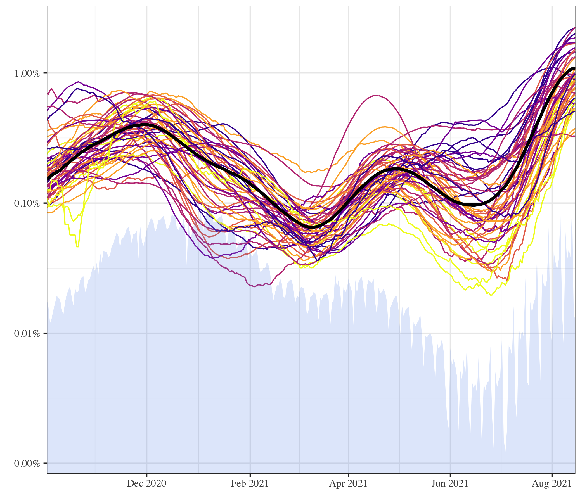

--- 
title: "UBC Stat 406 Worksheets"
author: "Daniel J. McDonald and Matías Salibián-Barrera"
date: "`r Sys.Date()`"
site: bookdown::bookdown_site
output: bookdown::bs4_book
documentclass: book
bibliography: [book.bib, packages.bib]
nocite: "@*"
link-citations: yes
links-as-notes: true
colorlinks: true
url: https://ubc-stat.github.io/stat-406-worksheets
github-repo: ubc-stat/stat-406-worksheets
description: "These notes accompany the lectures for UBC's Stat 406."
---

# Stat 406 Worksheets {-}

 **Authors:** [Daniel J. McDonald](https://dajmcdon.github.io/) [Matías Salibián-Barrera](https://www.stat.ubc.ca/users/matias-salibian-barrera)  **Last updated:**  `r format(Sys.Date(), "%d %B %Y")`

 
 
 
 
 
 
 
 
 
 
 
 

